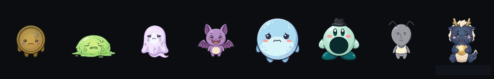

# BTC Pet Desktop

바탕화면 위에 항상 떠 있는 **비트코인 선물 시세 펫** (Windows).
귀여운 캐릭터가 시세에 따라 웃고, 뛰고, 녹아내리며 실시간 가격을 알려줍니다.

## 이런 프로그램이에요

- 어떤 창 위에서도 보이는 **투명 · 항상 위(always-on-top)** 펫
- 가격이 오르내리면 캐릭터의 **표정과 움직임이 바뀜** — 급등하면 신나서 점프, 급락하면 시무룩·녹아내림
- 원하는 자리에 **드래그**로 옮기고, 방해되면 마우스가 그냥 통과하게 설정 가능
- 펫을 클릭하면 **가격 · 캔들 차트 · 김치 프리미엄** 패널이 열림

## 주요 기능

- **20종 캐릭터** — 동전 · 슬라임 · 로봇 · 고스트 · 시바견 · 공룡 · 풍선복어 등, 저마다 성격에 맞는 고유 모션 (예: 김프는 급등하면 부풀고, 불장은 불타오르고, 청산이는 급락하면 승천)
- **무드 표현** — 최근 시세 흐름을 읽어 평온 / 급등 / 급락 상태로 자동 전환
- **봉 마감 이펙트** — 캔들 마감 시각에 맞춰 코인 플립 · 차트 애니메이션
- **가격 패널** (펫 클릭) — 실시간 가격, 15분 / 1시간 / 4시간 / 일봉 캔들 차트, 업비트 가격과 김치 프리미엄, 투명도 조절
- **표시 스타일 2종** — 캐릭터 펫 / 심플한 탁상시계형
- **크기 조절** — 작게(72) · 보통(90) · 크게(110)
- **차트 이펙트 선택** — 캔들 흐름 / 단일 캔들 / 긴박 모드(로켓 · 번개)
- **멀티 모니터 지원** — 펫이 있는 화면 기준으로 패널이 따라옴
- **자동 업데이트** — 새 버전이 나오면 알려주고, **동의하면** 내려받아 설치 (여부는 항상 사용자가 선택)

# BTC Pet 🪙

비트코인 시세를 캐릭터 펫으로 — 바탕화면 위젯

*급락장: 우는 놈, 녹는 놈, 승천하는 놈, 혼자 신난 놈(숏충이), 물에 빠지는 용*

## 캐릭터 20종

## 🎮 [라이브 데모 (인터랙티브)](https://stealer99.github.io/btc-pet-desktop/)

## 사용법

- **펫 클릭** — 가격 · 차트 패널 열기/닫기
- **펫 드래그** — 원하는 위치로 이동
- **우클릭 (펫 또는 트레이 아이콘)** — 설정 메뉴
  - 캐릭터 · 크기 · 표시 스타일 · 차트 이펙트 변경
  - 패널 항상 표시 / 펫에 붙여다니기
  - 클릭 통과 (펫이 마우스를 막지 않게)
  - 부팅 시 자동 실행
  - **업데이트 확인** · 현재 버전 표시
  - 보이기/숨기기 · 종료

## 설치

[Releases](https://github.com/stealer99/btc-pet-desktop/releases)에서 최신 `BTC Pet Setup x.x.x.exe`를 내려받아 실행하세요.
설치 후에는 새 버전이 나올 때마다 앱이 알아서 알려줍니다.

## 제작 · 라이선스

**BTC Pet Desktop** — 캐릭터 디자인 · 개발 by **stealer** ([@stealer99](https://github.com/stealer99))

© 2026 stealer · [MIT License](LICENSE) — 자유롭게 사용·수정·배포할 수 있으나, 저작권 표시(위 문구)는 유지해 주세요.
